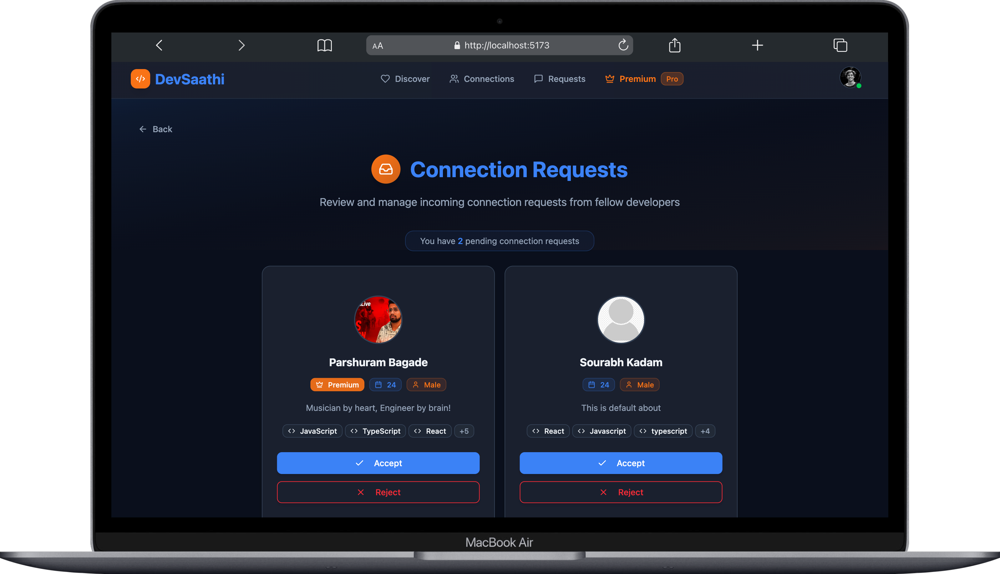
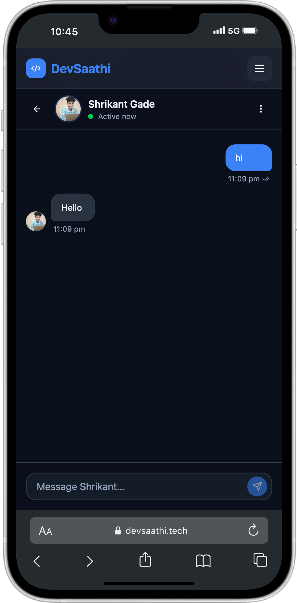

# DevSaathi - Connect with Developers 🚀

**Live Demo:** [https://devsaathi.tech](https://devsaathi.tech)

<p align="center">
   
</p>

DevSaathi is a modern social networking platform built specifically for developers to connect, collaborate, and grow together. Think of it as a professional networking app where developers can find like-minded peers, send connection requests, and chat in real-time.

## ✨ Key Features

- **Smart Developer Feed** - Discover developers with similar interests and skills
- **Connection System** - Send and receive connection requests with accept/reject functionality
- **Real-time Chat** - Instant messaging with Socket.IO for seamless communication
- **Profile Management** - Complete profile customization with image upload via Cloudinary
- **Premium Membership** - Enhanced features with Razorpay payment integration
- **Responsive Design** - Mobile-first approach with modern dark theme UI

## 🛠️ Tech Stack

**Frontend:**

- React 18 + TypeScript
- Redux Toolkit for state management
- Tailwind CSS + ShadCN UI components
- Socket.IO client for real-time features

**Backend:**

- Node.js + Express.js
- MongoDB with Mongoose ODM
- Socket.IO for real-time communication
- JWT authentication with secure cookies

**Additional Services:**

- Cloudinary for image storage
- Razorpay for payment processing
- AWS EC2 for deployment

## 🚀 Quick Start

### Prerequisites

- Node.js (v16 or higher)
- MongoDB database
- Cloudinary account
- Razorpay account (for payments)

### Installation

1. **Clone the repository**

   ```bash
   git clone https://github.com/parshurambagade/devsaathi.git
   cd devsaathi
   ```

2. **Setup Backend**

   ```bash
   cd server
   npm install
   cp .env.example .env
   # Fill in your environment variables
   npm start
   ```

3. **Setup Frontend**
   ```bash
   cd client
   npm install
   npm run dev
   ```

### Environment Variables

Create `.env` file in server directory:

```env
MONGODB_URI=your_mongodb_connection_string
JWT_SECRET=your_jwt_secret
CLOUDINARY_CLOUD_NAME=your_cloudinary_name
CLOUDINARY_API_KEY=your_cloudinary_key
CLOUDINARY_API_SECRET=your_cloudinary_secret
RAZORPAY_KEY_ID=your_razorpay_key
RAZORPAY_KEY_SECRET=your_razorpay_secret
```

## 📱 How It Works

1. **Sign Up/Login** - Create your developer profile with skills and interests
2. **Explore Feed** - Browse through developer profiles and send connection requests
3. **Manage Connections** - Accept/reject incoming requests and view your connections
4. **Start Chatting** - Real-time messaging with your connections
5. **Go Premium** - Unlock additional features like unlimited interactions and profile boost

## 🎯 Project Highlights

- **Clean Architecture** - Organized client-server structure with proper separation of concerns
- **Modern UI/UX** - Responsive design with smooth animations and intuitive user experience
- **Real-time Features** - Live chat functionality using WebSocket connections
- **Secure Authentication** - JWT-based auth with HTTP-only cookies
- **Payment Integration** - Complete payment flow with webhook handling
- **Production Ready** - Deployed on AWS with proper error handling and validation

## 📸 Screenshots

The app features a modern dark theme with glassmorphism effects, responsive card layouts, and smooth micro-interactions that make the user experience engaging and professional.

## Screenshots & Demo

Desktop:





Mobile:

<p align="center">
   
   
  
</p>

Screen recording (mp4):

[Watch demo](client/public/devtinder-demo.mp4)

## 🤝 Contributing

This is a portfolio project, but feedback and suggestions are always welcome! Feel free to open an issue or reach out.

## 📧 Contact

**Parshuram Bagade**

- GitHub: [@parshurambagade](https://github.com/parshurambagade)
- Email: parshuram.dev@outlook.com

---

_Built with ❤️ for the developer community_
